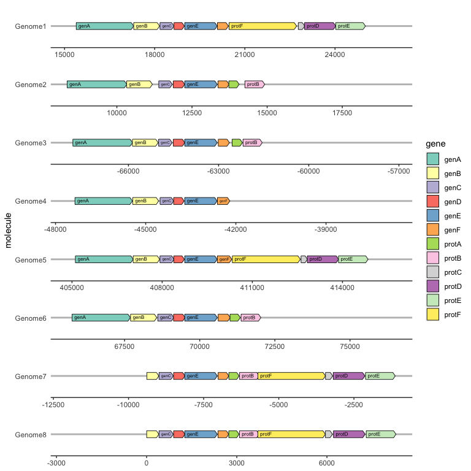
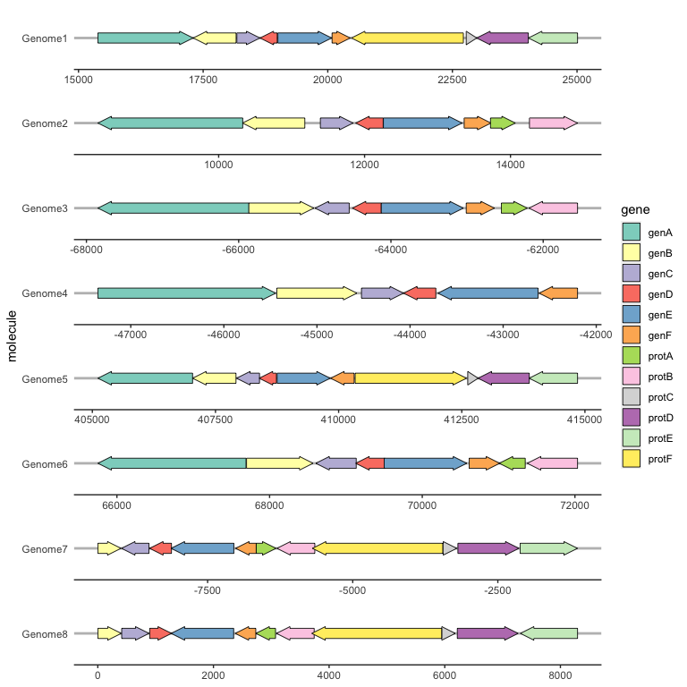

[](https://travis-ci.org/wilkox/gggenes)
[](https://cran.r-project.org/package=gggenes)

**‘gggenes’ is a (quite small) set of tools for drawing gene arrow maps
with ‘ggplot2.’**

## Installing ‘gggenes’

Install the stable version of ‘gggenes’ from CRAN:

`install.packages("gggenes")`

If you want the development version, install it from GitHub:

`devtools::install_github("wilkox/gggenes")`

## Drawing gene arrows with `geom_gene_arrow`

`geom_gene_arrow` is a ‘ggplot2’ geom that represents genes with arrows.
The start and end locations of the genes within their molecule(s) are
mapped to the `xmin` and `xmax` aesthetics respectively. These start and
end locations are used to determine the directions in which the arrows
point. The `y` aesthetic must be mapped to the molecule(s). If you are
drawing more than one molecule, and the numerical locations of the genes
are not similar across molecules, you almost certainly want to facet the
plot with `scales = "free"` to avoid drawing ridiculously large
molecules with ridiculously tiny genes.

``` r
library(ggplot2)
library(gggenes)

ggplot2::ggplot(example_genes, ggplot2::aes(xmin = start, xmax = end, y =
                                            molecule, fill = gene)) +
  geom_gene_arrow() +
  ggplot2::facet_wrap(~ molecule, scales = "free", ncol = 1) +
  ggplot2::scale_fill_brewer(palette = "Set3")
```

<!-- -->

## Beautifying the plot with `theme_genes`

Because the resulting plot can look cluttered, a ‘ggplot2’ theme
`theme_genes` is provided with some sensible
defaults.

``` r
ggplot2::ggplot(example_genes, ggplot2::aes(xmin = start, xmax = end, y =
                                            molecule, fill = gene)) +
  geom_gene_arrow() +
  ggplot2::facet_wrap(~ molecule, scales = "free", ncol = 1) +
  ggplot2::scale_fill_brewer(palette = "Set3") +
  theme_genes()
```

<!-- -->

## Aligning genes across facets with `make_alignment_dummies`

Often you will want a certain gene to be vertically aligned across the
faceted molecules. `make_alignment_dummies` generates a set of ‘dummy’
genes that if added to the plot with `geom_blank` will extend the range
of each facet to visually align the selected gene across facets.

``` r
dummies <- make_alignment_dummies(
  example_genes,
  ggplot2::aes(xmin = start, xmax = end, y = molecule, id = gene),
  on = "genE"
)

ggplot2::ggplot(example_genes, ggplot2::aes(xmin = start, xmax = end, y =
                                            molecule, fill = gene)) +
  geom_gene_arrow() +
  ggplot2::geom_blank(data = dummies) +
  ggplot2::facet_wrap(~ molecule, scales = "free", ncol = 1) +
  ggplot2::scale_fill_brewer(palette = "Set3") +
  theme_genes()
```

<!-- -->

## Labelling genes with `geom_gene_label`

To label individual genes, provide a `label` aesthetic and use
`geom_gene_label`. `geom_gene_label` uses the
[‘ggfittext’](https://github.com/wilkox/ggfittext) package to fit
the label text inside the gene arrows; see the ‘ggfittext’ documentation
for more details on how it resizes and reflows text to make it
fit.

``` r
ggplot2::ggplot(example_genes, ggplot2::aes(xmin = start, xmax = end, y =
                                            molecule, fill = gene, label = gene)) +
  geom_gene_arrow(arrowhead_height = unit(3, "mm"), arrowhead_width = unit(1, "mm")) +
  geom_gene_label(align = "left") +
  ggplot2::geom_blank(data = dummies) +
  ggplot2::facet_wrap(~ molecule, scales = "free", ncol = 1) +
  ggplot2::scale_fill_brewer(palette = "Set3") +
  theme_genes()
```

<!-- -->

## Reversing some genes with the optional `forward` aesthetic

Sometimes you might want to reverse the direction of some genes from
that implied by `xmin` and `xmax`. For example, you might want to draw
both a forward and reverse strand within each facet, and reverse the
direction of all the genes on the reverse strand. The optional `forward`
aesthetic is intended for this sort of situation.

If `forward` is TRUE (the default), or any value that coerces to TRUE
such as 1, the gene will be drawn pointing in the normal direction,
i.e. that implied by `xmin` and `xmax`. If `forward` is FALSE, or any
value that coerces to FALSE such as -1, the gene will be drawn in the
reverse of this implied direction. In the following example, the
`forward` aesthetic has been used to reverse the direction of all genes
on the reverse strand from that implied by `xmin` and
`xmax`.

``` r
example_genes$direction <- ifelse(example_genes$strand == "forward", 1, -1)
ggplot2::ggplot(subset(example_genes, molecule == "Genome1"),
                ggplot2::aes(xmin = start, xmax = end, y = strand, fill = gene,
                             forward = direction)) +
  geom_gene_arrow() +
  theme_genes()
```

<!-- -->

## Viewing subgene segments

We can highlight subgene segments, such as protein domains or local
alignments, by using the subgene\_arrow geom.

This works similarly to `geom_gene_arrow`, but in addition to `xmin` and
`xmax` (which determines the gene boundary), we need the aesthetics
`xsubmin` and `xsubmax`, which will produce pretty arrowheads as long as
`xmin>=xsubmin` and `xmax>=xsubmax` for all subgenes.

The suggested usage is to use geom\_gene\_arrow with no fill, and then
add a subgene layer over this. This example uses randomly drawn
segments:

``` r
example_subgenes$direction <- ifelse(example_subgenes$strand == "forward", 1, -1)
ggplot2::ggplot(example_genes,
                ggplot2::aes(xmin = start, xmax = end, y = molecule,
                             forward = direction)) +
  ggplot2::facet_wrap(~ molecule, scales = "free", ncol = 1) +
  geom_gene_arrow(fill='white') +
  geom_subgene_arrow(data=example_subgenes,
    ggplot2::aes(xmin = start, xmax = end, y = molecule, fill = gene,
                 forward = direction, xsubmin=from, xsubmax=to), color='black', alpha=.7) +
  theme_genes()
```

<!-- -->
